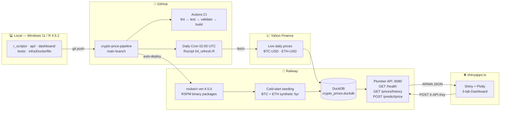

# 🔐 crypto-price-pipeline

[](https://github.com/Kayterthesly/crypto-price-pipeline/actions/workflows/ci.yml)
[](https://www.r-project.org/)
[](LICENSE)
[](https://github.com/Kayterthesly/crypto-price-pipeline/commits/main)

> **Production-grade cryptocurrency price analysis and short-term ARIMA forecasting pipeline built entirely in R.**  
> Live dashboard · Secured REST API · Automated daily retraining · Model drift detection

| | |
|---|---|
| 🌐 **Live Dashboard** | https://e9yw5n-kayterthesly.shinyapps.io/crypto-price-pipeline/ |
| 🚀 **Live API** | https://crypto-price-pipeline-production.up.railway.app/health |
| 👤 **Author** | Kingsley Akenu ([@Kayterthesly](https://github.com/Kayterthesly)) · KAIZEN 改善 |
| 🛠️ **Stack** | R 4.5.2 · DuckDB · tidyquant · ARIMA · Plumber · Shiny |

---

## 📋 Overview

`crypto-price-pipeline` ingests 5 years of daily BTC-USD and ETH-USD price data from Yahoo Finance, engineers 15 technical features (SMA-50, SMA-200, 30-day volatility, RSI-14, log returns, drawdown), fits ARIMA models with UUID-versioned registry, exposes forecasts via a secured Plumber REST API deployed on Railway, and visualises results in a 3-tab Shiny + Plotly dashboard on shinyapps.io.

**Crypto-native design — never equity assumptions:**
- Annualisation: `sqrt(365)` — crypto trades 365 days/year, not 252
- `ts(frequency = 1)` — no forced annual seasonality on daily returns
- No weekday filter — full calendar coverage, zero gap days
- `DATEDIFF()` not `julianday()` — DuckDB-native date arithmetic

---

## 🏗️ Architecture



---

## 📊 Model Performance

| Symbol | Model | RMSE (log return) | Daily Error | Train Rows | Test Rows | Split |
|--------|-------|--------------------|-------------|------------|-----------|-------|
| BTC-USD | ARIMA | 0.0233 | ~2.3% | 1,302 | 326 | 80/20 temporal |
| ETH-USD | ARIMA | 0.0358 | ~3.6% | 1,303 | 326 | 80/20 temporal |

*Temporal train-test split — never random. UUID-versioned model registry. Drift alert if RMSE > 1.25× best historical or > 5% absolute.*

---

## 🛠️ Tech Stack

| Layer | Technology |
|-------|-----------|
| Language | R 4.5.2 |
| Database | DuckDB (embedded, file-based) |
| Data ingestion | tidyquant / Yahoo Finance |
| Feature engineering | dplyr, TTR (SMA, RSI, rolling stats) |
| Forecasting | `forecast::auto.arima()` |
| Model versioning | UUID suffix + DuckDB `model_registry` |
| REST API | plumber |
| Dashboard | Shiny + Plotly + bslib |
| Testing | testthat, withr (isolated test DB) |
| Package management | renv (RSPM binary repo for Docker) |
| Containerisation | Docker (rocker/r-ver:4.5.0) |
| CI/CD | GitHub Actions |
| API deployment | Railway |
| Dashboard deployment | shinyapps.io |

---

## 🚀 Quick Start

### Prerequisites
R ≥ 4.5.0, RStudio, Git

### Local setup

```r
# 1. Clone and restore packages
# git clone https://github.com/Kayterthesly/crypto-price-pipeline.git
renv::restore()

# 2. Create .Renviron at project root:
# ENV_MODE=synthetic
# DB_PATH=data/crypto_prices.duckdb
# LOG_LEVEL=INFO

# 3. Run full pipeline
source(here::here("r_scripts", "00_workspace_init.R"))
source(here::here("r_scripts", "01_ingestion.R"))
fetch_and_store_history("BTC-USD", years_back = 5)
fetch_and_store_history("ETH-USD", years_back = 5)

source(here::here("r_scripts", "02_features.R"))
generate_pipeline_features("BTC-USD")
generate_pipeline_features("ETH-USD")

source(here::here("r_scripts", "03_modeling.R"))
result <- compute_asset_forecasts("BTC-USD", forecast_horizon = 30)
print_forecast_summary(result)

# 4. Launch dashboard (stop API first if running)
shiny::runApp(here::here("dashboard"))
```

### Live API test

```r
library(httr)
httr::GET(
  "https://crypto-price-pipeline-production.up.railway.app/health",
  httr::add_headers("X-API-Key" = Sys.getenv("API_SECRET_KEY"))
)
# Status: 200
# {"status":"ok","env_mode":"live_yahoo","r_version":"4.5.0",...}
```

---

## 📁 Project Structure

```
crypto-price-pipeline/
├── r_scripts/
│   ├── 00_workspace_init.R   # directory scaffold, env validation
│   ├── 00_utils.R            # shared DuckDB connection helper
│   ├── 01_ingestion.R        # Yahoo Finance → DuckDB raw_prices
│   ├── 02_features.R         # SMA, RSI, volatility, drawdown (direct SQL)
│   ├── 03_modeling.R         # ARIMA + UUID-versioned model_registry
│   └── 04_refresh.R          # daily refresh + drift detection
├── api/
│   ├── plumber.R             # GET /health · GET /prices/history · POST /predict/price
│   └── run_api.R             # launcher + cold-start DB seeding
├── dashboard/
│   └── app.R                 # 3-tab Shiny: Forecast · Model Info · About
├── tests/
│   ├── unit/
│   │   ├── test_features.R   # 6 tests — isolated test DB, withr teardown
│   │   └── test_modeling.R   # 11 assertions — UUID uniqueness, RMSE bounds
│   └── data_tests.R          # 14 production DB integrity checks
├── infra/
│   └── Dockerfile            # rocker/r-ver:4.5.0, RSPM binaries, HEALTHCHECK
├── .github/workflows/
│   └── ci.yml                # lint → test → validate → Docker build + daily cron
├── renv.lock                 # locked package versions
├── LICENSE                   # MIT
└── CONTRIBUTING.md
```

---

## 🧪 Testing

```r
# Unit tests — isolated test DB per file, withr teardown, gc() for Windows handles
library(testthat); library(withr)
testthat::test_file(here::here("tests", "unit", "test_features.R"))
# FAIL 0 | PASS 6

testthat::test_file(here::here("tests", "unit", "test_modeling.R"))
# FAIL 0 | PASS 11
```

```bash
# Data integrity tests — 14 checks on production DuckDB
Rscript tests/data_tests.R
# Passed: 14 | Failed: 0
```

**Test isolation:** Each unit test creates its own `data/test_crypto.duckdb`, uses `withr::defer()` for teardown, and calls `gc()` to release Windows file handles. Production DB is never touched during test runs.

---

## 🌐 Deployment

### Railway — Plumber REST API

- Dockerfile path: `infra/Dockerfile` (set in Railway Settings → Build)
- RSPM binary packages — zero C++ compilation on Ubuntu 24.04 Noble
- Cold-start seeding: synthetic BTC + ETH generated if DB absent (~30 seconds)
- Dynamic port binding: `port <- as.integer(Sys.getenv("PORT", unset = "8000"))`
- Authentication: `X-API-Key` header required on all forecast endpoints
- Rate limiting: 10 requests per 60 seconds per client IP
- CORS: enabled for shinyapps.io cross-origin calls

### shinyapps.io — Shiny Dashboard

- Deployed via `rsconnect::deployApp()`
- Environment variables bundled via `dashboard/.Renviron` (created + deleted per deploy — never committed)
- Calls Railway API for all forecasts; falls back to direct computation if API unavailable
- Historical prices fetched from Railway `/prices/history` endpoint (no local DuckDB required)

---

## 📈 Pipeline Log

### Stage 0 — Workspace Setup
**Date:** 2026-06-06 | **Commit:** `6176aab` | **Status:** ✅ Complete
- renv initialized, packages locked: here, logger, purrr
- `.Renviron`: `ENV_MODE=synthetic`, `DB_PATH=data/crypto_prices.duckdb`, `LOG_LEVEL=INFO`
- Crypto-native constants: `sqrt(365)` annualization, `ts_frequency=1`
- 9 directories scaffolded: `data/`, `r_scripts/`, `api/`, `models/`, `notes/`, `tests/unit/`, `tests/integration/`, `dashboard/`, `infra/`

---

### Stage 1 — Data Ingestion
**Date:** 2026-06-07 | **Commit:** `0f3a07c` | **Status:** ✅ Complete
- DuckDB store: `data/crypto_prices.duckdb`
- Table: `raw_prices` — PRIMARY KEY `(symbol, date)`
- Crypto-native: no weekday filter, full 365-day calendar coverage
- Symbols: BTC-USD (1,825 rows, 100% coverage) · ETH-USD (1,826 rows)
- Upsert pattern: delete-then-append per symbol — multi-symbol safe, idempotent
- `tryCatch()` around all Yahoo Finance calls; `coalesce(adjusted, close)` for same-day NA

---

### Stage 2 — Feature Engineering
**Date:** 2026-06-07 | **Commit:** `3ae7000` | **Status:** ✅ Complete
- `feature_prices` table: 15 columns, both symbols preserved via symbol-aware write
- Crypto-native: `vol_30` uses `sqrt(365)` = 19.105 annualization — never `sqrt(252)`
- All rolling features lagged by 1 day — zero future leakage verified
- Features: `log_return`, `sma_50`, `sma_200`, `vol_30`, `rsi_14`, `rolling_max`, `drawdown`
- NA defence: `coalesce(adjusted, close)` in ingestion + `tidyr::fill(.direction="down")` in features

---

### Stage 3 — Modeling & Forecasting
**Date:** 2026-06-07 | **Commit:** `f0a2def` | **Status:** ✅ Complete
- ARIMA on log returns, `frequency=1` (no forced seasonality)
- BTC-USD: Train=1,300 · Test=325 · RMSE=0.023268
- UUID model versioning: `arima_BTCUSD_20260607_5ef82c4c` — no timestamp collision
- `model_registry` table: stores version, RMSE, data hash, forecast horizon, created_at
- Artifacts: `.rds` + `.json` saved to `models/`; MD5 data lineage hash on every run

---

### Stage 4 — REST API (Plumber)
**Date:** 2026-06-08 | **Commit:** `6c2fa55` | **Status:** ✅ Complete
- `GET /health` — liveness check, returns `env_mode`, `pipeline`, `r_version`, `timestamp`
- `POST /predict/price` — full ARIMA forecast, returns JSON with forecast + 95% CI + model metadata
- `trace_id` propagated through all log entries for request tracing
- Input validation + `tryCatch` error handling on all endpoints
- `auto_unbox = TRUE` JSON serialization — no array boxing on scalar values

---

### Stage 5 — Shiny Dashboard
**Date:** 2026-06-08 | **Commit:** `4176ad2` | **Status:** ✅ Complete
- Shiny + Plotly, bslib `flatly` theme, Inter font
- Tab 1 — Price & Forecast: historical price line + 95% CI cone + dashed forecast line
- Tab 2 — Model Info: metadata table + formatted forecast values (`format(date, "%Y-%m-%d")`)
- Tab 3 — About: crypto-native rationale, `sqrt(365)` explained, env vars via `Sys.getenv()` in UI
- Y-axis cap: `max(historical$adjusted) × 1.5` — prevents CI cone from hiding historical line
- Zero runtime bugs — all architectural fixes from predecessor (`r-price-pipeline`) pre-applied

---

### Stage 6 — Testing, Docker, GitHub Actions CI
**Date:** 2026-06-08 | **Commit:** `0cc4169` | **Status:** ✅ Complete
- testthat unit tests: features (FAIL 0 · PASS 6) + modeling (FAIL 0 · PASS 11 assertions)
- 14 data integrity tests on production DuckDB: schema, NULLs, coverage, UUID versioning
- Test isolation: `data/test_crypto.duckdb` per test file · `withr::defer()` teardown · `gc()` between calls
- Dockerfile: `rocker/r-ver:4.5.0` · RSPM binary repo · `HEALTHCHECK` · no secrets in image
- GitHub Actions CI: lint → test → data validate → Docker build
- Repo live: https://github.com/Kayterthesly/crypto-price-pipeline
- renv sync: `chore: sync renv.lock post-Stage 6` (`87abffe`)

---

### Stage 7A — Pipeline Completion
**Date:** 2026-06-09 | **Commit:** `01f6e47` | **Status:** ✅ Complete
- ETH-USD added to `model_registry`: ARIMA, RMSE=0.035621
- `batch_forecast_all_symbols()` — loops all symbols in `raw_prices` automatically
- `check_leakage()` expanded: validates all 5 features (`sma_50`, `sma_200`, `rolling_max`, `vol_30`, `rsi_14`)
- Integration test: full chain verified — ingest → features → forecast → registry (FAIL 0 · PASS 6)

---

### Stage 7B — API Security
**Date:** 2026-06-09 | **Commit:** `b5a5a76` | **Status:** ✅ Complete
- `X-API-Key` header authentication on all forecast endpoints
- In-memory rate limiter: 10 requests per 60 seconds per client IP
- CORS headers: browser clients (shinyapps.io) can call the Railway API cross-origin
- API key generated with `openssl::rand_bytes(32)` · stored in `.Renviron` + physical notebook
- Dashboard wired to Railway API via `API_BASE_URL` env var with direct-call fallback

---

### Stage 7C — Automation & Drift Detection
**Date:** 2026-06-09 | **Commit:** `f51c674` | **Status:** ✅ Complete
- `r_scripts/04_refresh.R` — daily refresh: ingest → features → forecast → drift check for all symbols
- GitHub Actions cron: triggers daily at 02:00 UTC via `schedule: cron: '0 2 * * *'`
- Drift detection: flags if `new_rmse / best_rmse > 1.25` OR `new_rmse - best_rmse > 0.05`
- Refresh report saved: `notes/refresh_YYYY-MM-DD.json`
- GitHub Secret `API_SECRET_KEY` configured for CI/CD
- Confirmed runs: BTC-USD ratio=1.008 · ETH-USD ratio=1.006 — both within thresholds

---

### Stage 7D — Showcase & Live Deployment
**Date:** 2026-06-10 to 2026-06-11 | **Status:** ✅ Complete

**Deployment fixes resolved (10 issues across 7 commits):**
- Railway Dockerfile path: set `infra/Dockerfile` in Settings → Build · context = `.`
- RSPM binary packages: `ENV RENV_CONFIG_REPOS_OVERRIDE` for Ubuntu 24.04 Noble — eliminated C++ compilation failures
- Docker cache bust: removed `COPY dashboard/` to force layer invalidation
- `dashboard/` excluded from container: API-only image; dashboard deployed separately
- Cold-start seeding: `api/run_api.R` auto-seeds synthetic BTC + ETH on fresh containers (~30s)
- `library(dbplyr)` removed: replaced `tbl() |> collect()` with `DBI::dbGetQuery()` + `as.Date()`
- Dynamic PORT: `as.integer(Sys.getenv("PORT", unset = "8000"))` — Railway assigns port 8080
- shinyapps.io env vars: bundled `dashboard/.Renviron` (created pre-deploy, deleted post-deploy)
- `source()` global scope fix: wrapped in `tryCatch` — fails silently on shinyapps.io, works locally
- `dashboard/rsconnect/` gitignored: `chore: ignore dashboard/rsconnect deployment metadata`

**Final deliverables:**
- Live Dashboard: https://e9yw5n-kayterthesly.shinyapps.io/crypto-price-pipeline/
- Live API: https://crypto-price-pipeline-production.up.railway.app/health
- API health: `{"status":"ok","env_mode":"live_yahoo","r_version":"4.5.0"}`
- Forecast confirmed: RMSE=0.0233 · Version `arima_BTCUSD_20260611_ab852573` · 30-day chart live
- LICENSE (MIT) + CONTRIBUTING.md added
- Commit: `bba2eca` (7D) · `c8f31a6` (dbplyr fix) · `723aa0c` (rsconnect gitignore)

---

### Stage 8 — README Showcase & Architecture Diagram
**Date:** 2026-06-11 | **Status:** ✅ Complete
- Full README rewrite: badges, Mermaid architecture diagram, model performance table, tech stack
- Detailed pipeline log preserved with all technical specifics (dates, commits, row counts, RMSE)
- Stage 8 notes released

---

## 📜 License

MIT © 2026 [Kingsley Akenu](https://github.com/Kayterthesly)